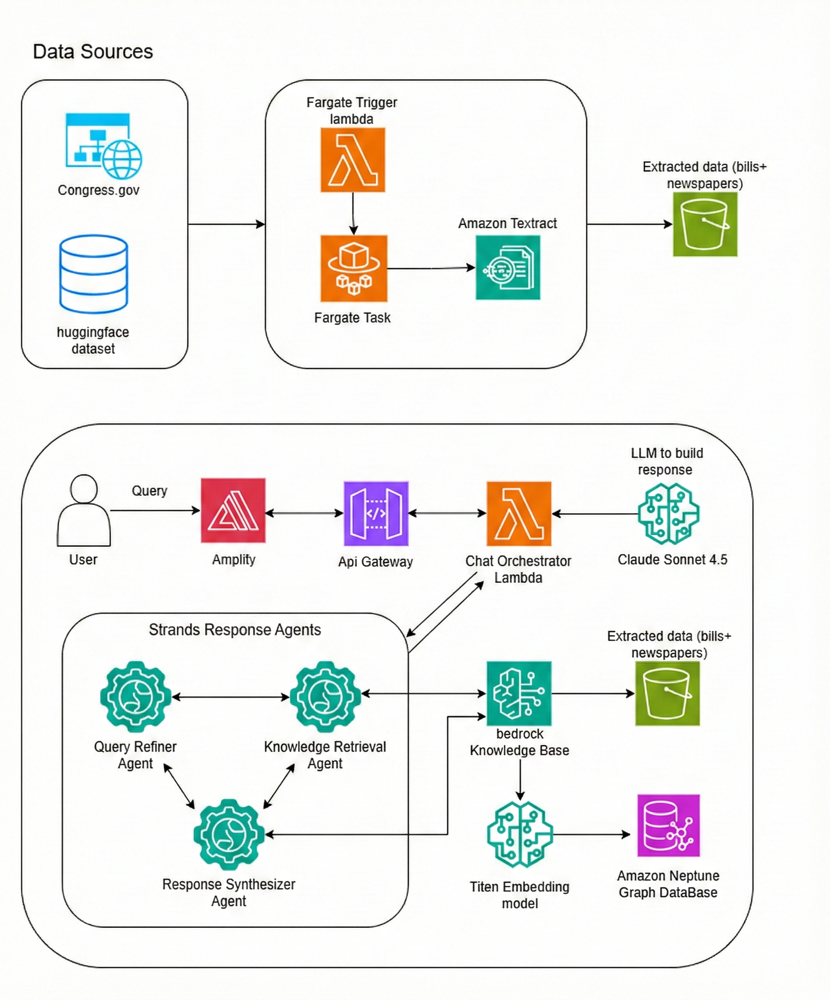

# Cultural Heritage Chatbot - Library of Congress

An AI-powered conversational interface designed to help users explore historical documents from America's founding era, including historical Constitutional materials, Congressional legislation, historical newspapers, and related legal materials. For questions about this experiment, please contact digitalstrategy@loc.gov or visit https://www.loc.gov/digital-strategy

## Disclaimers

Customers are responsible for making their own independent assessment of the information in this document.

This document:

(a) is for informational purposes only,

(b) references AWS product offerings and practices, which are subject to change without notice,

(c) does not create any commitments or assurances from AWS and its affiliates, suppliers or licensors. AWS products or services are provided "as is" without warranties, representations, or conditions of any kind, whether express or implied. The responsibilities and liabilities of AWS to its customers are controlled by AWS agreements, and this document is not part of, nor does it modify, any agreement between AWS and its customers, and

(d) is not to be considered a recommendation, viewpoint of AWS or the Library of Congress.

(e) is an experiment to demonstrate the possibilities for the use of these services with cultural heritage materials.

Additionally, you are solely responsible for testing, security and optimizing all code and assets on GitHub repo, and all such code and assets should be considered:

(a) as-is and without warranties or representations of any kind,

(b) not suitable for production environments, or on production or other critical data, and

(c) to include shortcuts in order to support rapid prototyping such as, but not limited to, relaxed authentication and authorization and a lack of strict adherence to security best practices.

All work produced is open source. More information can be found in the GitHub repo.

## Index

| Description | Link |
|-------------|------|
| Overview | [Overview](#overview) |
| Architecture | [Architecture](#architecture-diagram) |
| Detailed Architecture | [Architecture Deep Dive](docs/ARCHITECTURE.md) |
| Deployment | [Deployment Guide](docs/DEPLOYMENT.md) |
| Prerequisites | [Prerequisites](docs/PREREQUISITES.md) |
| Credits | [Credits](#credits) |
| License | [License](#license) |

## Overview

The Cultural Heritage Chatbot provides an intelligent, persona-based interface for accessing and understanding historical documents from a selection of materials from the Library of Congress. Users can interact with the chatbot using different personas tailored to their expertise level and information needs.

### Key Features

- **AI-Powered Conversations** using AWS Bedrock with Claude 4.5 Sonnet
- **GraphRAG Knowledge Base** with Neptune Analytics for relationship discovery
- **Multiple Personas** for different user expertise levels
- **Source Citations** with links to original documents
- **Session Memory** for contextual conversation continuity
- **Historical Coverage** including Congressional bills (1789-1875) and newspapers (1770-1810)

### Personas

| Persona | Target Audience | Response Style |
|---------|-----------------|----------------|
| **Interested Person** | General public, students | Clear, accessible, educational |
| **Policy Analyst** | Policy professionals, researchers | Analytical, precedent-focused |
| **Research Journalist** | Writers, content creators | Narrative, contextual |
| **Law Student** | Legal professionals, students | Precise legal terminology |

## Architecture Diagram



The application implements a serverless architecture on AWS, combining:

- **Frontend**: Next.js 15 application hosted on AWS Amplify with built-in CDN
- **Backend**: AWS CDK-deployed infrastructure with API Gateway and Lambda
- **AI Layer**: AWS Bedrock Knowledge Base with GraphRAG (Neptune Analytics)
- **Data Storage**: S3 for documents, Neptune for graph relationships
- **Memory**: AgentCore Memory for conversation history
- **Data Collection**: ECS Fargate for long-running ingestion tasks

For a detailed deep dive into the architecture, see [docs/ARCHITECTURE.md](docs/ARCHITECTURE.md).

## Deployment

For detailed deployment instructions, including prerequisites and step-by-step guides, see [docs/DEPLOYMENT.md](docs/DEPLOYMENT.md).

### Quick Start

```bash
# Clone the repository
git clone https://github.com/ASUCICREPO/Loc_Project.git
cd Loc_Project/backend

# Run the deployment script
chmod +x deploy.sh
./deploy.sh
```

### Prerequisites

- AWS Account with Bedrock model access enabled
- Congress.gov API Key ([Sign up here](https://api.congress.gov/sign-up/))
- Recommended regions: `us-west-2` or `us-east-1`

For complete prerequisites, see [docs/PREREQUISITES.md](docs/PREREQUISITES.md).

## Directory Structure

```
Loc_Project/
├── backend/                    # AWS CDK infrastructure
│   ├── bin/                    # CDK app entry point
│   ├── lib/                    # CDK stack definitions
│   │   └── chronicling-america-stack.ts
│   ├── lambda/                 # Lambda function code
│   │   ├── chat-handler/       # Main chat handler
│   │   ├── fargate-trigger/    # ECS task launcher
│   │   ├── kb-sync-trigger/    # Knowledge Base sync
│   │   └── kb-transformation/  # Document processing
│   ├── fargate/                # Data collection container
│   │   ├── collect_bills.py    # Congress.gov data collector
│   │   ├── direct_ingestion.py # KB direct ingestion
│   │   └── Dockerfile
│   ├── scripts/                # Utility scripts
│   │   └── create_memory.py    # AgentCore Memory setup
│   ├── deploy.sh               # One-command deployment
│   ├── cdk.json
│   └── package.json
├── frontend/                   # Next.js frontend application
│   ├── app/
│   │   ├── components/         # React components
│   │   ├── config/             # Configuration files
│   │   ├── globals.css
│   │   ├── layout.tsx
│   │   └── page.tsx
│   ├── public/                 # Static assets
│   └── package.json
├── docs/
│   ├── ARCHITECTURE.md         # Architecture deep dive
│   ├── DEPLOYMENT.md           # Deployment guide
│   ├── PREREQUISITES.md        # Prerequisites guide
│   └── ArchitectureDiagram.png
└── README.md
```

## Features

### Core Functionality

- **Intelligent Q&A**: Natural language processing for historical document queries
- **Persona-Based Responses**: Tailored responses based on user expertise level
- **Source Attribution**: Every response includes citations to original documents
- **Conversation Memory**: Context-aware responses using AgentCore Memory

### Data Sources

- **Congressional Bills**: Bills from Congress 1-16 (1789-1875) via Congress.gov API
- **Historical Newspapers**: Chronicling America collection (1770-1810) via Hugging Face
- **GraphRAG Processing**: Entity and relationship extraction for enhanced search

### Technical Features

- **Serverless Architecture**: Auto-scaling AWS Lambda functions
- **GraphRAG Search**: Semantic search with Neptune Analytics graph traversal
- **Query Enhancement**: LLM improves vague follow-up questions automatically
- **Direct Ingestion API**: Handles large document collections (59K+ newspapers)

## Data Flow

1. **User Interaction**: User sends question through Next.js frontend on Amplify
2. **API Gateway**: Request routed to Chat Handler Lambda
3. **Memory Load**: Conversation history retrieved from AgentCore Memory
4. **Query Enhancement**: Vague queries improved using conversation context
5. **Knowledge Base Query**: Semantic search with Neptune graph traversal
6. **AI Response**: Claude 4.5 Sonnet generates persona-appropriate response
7. **Memory Save**: Conversation saved for future context
8. **Source Attribution**: Response returned with document citations

## Example Queries

- "What were the key debates during the Constitutional Convention?"
- "Explain the significance of the First Amendment"
- "What Congressional legislation addressed commerce in the early republic?"
- "Tell me about the Federalist Papers"
- "What legal precedents were set in Marbury v. Madison?"
- "Show me bills about taxation from Congress 6"

## Credits

This application was developed for the Library of Congress to support exploration of America's historical documents.

**Built with:**
- AWS Bedrock for AI/ML capabilities (Claude 4.5 Sonnet)
- Neptune Analytics for GraphRAG
- React and Material-UI for the frontend
- AWS CDK for infrastructure as code
- Next.js 15 for server-side rendering

## License

This project is licensed under the MIT License - see the [LICENSE](./LICENSE) file for details.
