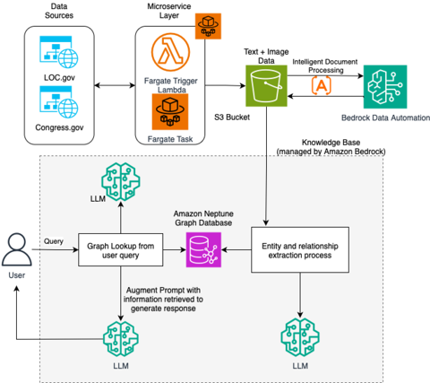

# Cultural Heritage Chatbot - Library of Congress

An AI-powered conversational interface designed to help users explore historical documents from America's founding era, including Constitutional history, Congressional legislation, historical newspapers, and legal precedents.

## Overview

The Cultural Heritage Chatbot provides an intelligent, persona-based interface for accessing and understanding historical documents from the Library of Congress collections. Users can interact with the chatbot using different personas tailored to their expertise level and information needs.

## Disclaimers
Customers are responsible for making their own independent assessment of the information in this document.

This document:

(a) is for informational purposes only,

(b) references AWS product offerings and practices, which are subject to change without notice,

(c) does not create any commitments or assurances from AWS and its affiliates, suppliers or licensors. AWS products or services are provided "as is" without warranties, representations, or conditions of any kind, whether express or implied. The responsibilities and liabilities of AWS to its customers are controlled by AWS agreements, and this document is not part of, nor does it modify, any agreement between AWS and its customers, and

(d) is not to be considered a recommendation or viewpoint of AWS.

Additionally, you are solely responsible for testing, security and optimizing all code and assets on GitHub repo, and all such code and assets should be considered:

(a) as-is and without warranties or representations of any kind,

(b) not suitable for production environments, or on production or other critical data, and

(c) to include shortcuts in order to support rapid prototyping such as, but not limited to, relaxed authentication and authorization and a lack of strict adherence to security best practices.

All work produced is open source. More information can be found in the GitHub repo.

## Features

### 🎭 Multiple Personas
- **Interested Person**: Accessible explanations based on curated historical materials
- **Policy Analyst**: Focus on historical precedents and constitutional interpretations
- **Research Journalist**: Historical and cultural context in a journalistic tone
- **Law Student**: Precise legal terminology with case references and legal reasoning

### 🔍 Key Capabilities
- Conversational search through historical documents
- Context-aware responses based on selected persona
- Real-time persona switching during conversations
- Source citation and document references
- Markdown-formatted responses
- Session persistence and conversation history

### 📚 Historical Coverage
- Constitutional history and amendments
- Congressional bills and legislation (1789-1821)
- Historical newspapers and documents
- Legal precedents and court cases
- Federalist Papers and founding documents

## Architecture



### System Components

```
┌─────────────────────────────────────────────────────────────┐
│                         Frontend                             │
│  (Next.js 15 + React 18 + Material-UI)                     │
│  - Persona selection interface                              │
│  - Chat interface with markdown support                     │
│  - Session management                                        │
└──────────────────────┬──────────────────────────────────────┘
                       │
                       │ HTTPS/REST API
                       │
┌──────────────────────▼──────────────────────────────────────┐
│                      Backend (AWS)                           │
│                                                              │
│  ┌─────────────────────────────────────────────────────┐   │
│  │  API Gateway → Lambda Functions                      │   │
│  │  - Chat endpoint (/chat)                            │   │
│  │  - Persona routing                                   │   │
│  └─────────────────────────────────────────────────────┘   │
│                                                              │
│  ┌─────────────────────────────────────────────────────┐   │
│  │  AWS Bedrock Agent                                   │   │
│  │  - Claude AI model integration                       │   │
│  │  - Agent memory (AgentCore Memory)                   │   │
│  │  - Knowledge base integration                        │   │
│  └─────────────────────────────────────────────────────┘   │
│                                                              │
│  ┌─────────────────────────────────────────────────────┐   │
│  │  Data Storage                                        │   │
│  │  - Neptune (Graph Database)                         │   │
│  │  - S3 (Document Storage)                            │   │
│  │  - OpenSearch (Vector Search)                       │   │
│  └─────────────────────────────────────────────────────┘   │
└──────────────────────────────────────────────────────────────┘
```

## Project Structure

```
Loc_Project/
├── frontend/                 # Next.js frontend application
│   ├── app/
│   │   ├── components/      # React components
│   │   │   ├── ChatBody.jsx        # Main chat interface
│   │   │   ├── BotReply.jsx        # Bot message component
│   │   │   ├── UserReply.jsx       # User message component
│   │   │   ├── MarkdownContent.jsx # Markdown renderer
│   │   │   └── ...
│   │   ├── config/          # Configuration files
│   │   ├── globals.css      # Global styles
│   │   └── layout.tsx       # Root layout
│   ├── public/              # Static assets
│   ├── package.json
│   └── README.md            # Frontend-specific docs
│
├── backend/                 # AWS CDK infrastructure
│   ├── lib/                # CDK stack definitions
│   ├── lambda/             # Lambda function code
│   ├── fargate/            # Fargate container configs
│   ├── scripts/            # Deployment scripts
│   │   └── create_memory.py
│   ├── cdk.json
│   ├── package.json
│   └── README.md           # Backend-specific docs
│
└── README.md               # This file
```

## Getting Started

### Prerequisites

- **Node.js** 18 or higher
- **Python** 3.9 or higher
- **AWS CLI** configured with appropriate credentials
- **AWS CDK** 2.x installed globally
- **Docker** (for local Lambda development)

### Quick Start

#### 1. Clone the Repository

```bash
git clone https://github.com/ASUCICREPO/Loc_Project.git
cd Loc_Project
```

#### 2. Frontend Setup

```bash
cd frontend
npm install
npm run dev
```

The frontend will be available at `http://localhost:3000`

#### 3. Backend Setup

```bash
cd backend
npm install
npm run setup-memory  # Create Bedrock Agent memory
npm run deploy        # Deploy to AWS
```

### Configuration

#### Frontend Environment Variables

Create a `.env.local` file in the `frontend/` directory:

```env
NEXT_PUBLIC_API_BASE_URL=https://your-api-gateway-url.amazonaws.com
NEXT_PUBLIC_CHAT_ENDPOINT=https://your-api-gateway-url.amazonaws.com/chat
```

#### Backend Configuration

Update `backend/cdk.json` with your AWS configuration:
- Region
- Account ID
- Bedrock Agent settings
- Neptune cluster settings

## Development

### Running Locally

**Frontend:**
```bash
cd frontend
npm run dev
```

**Backend (Local Testing):**
```bash
cd backend
npm run build
npm run watch  # Watch for changes
```

### Building for Production

**Frontend:**
```bash
cd frontend
npm run build
npm start
```

**Backend:**
```bash
cd backend
npm run deploy
```

## Usage

### Starting a Conversation

1. Open the application in your browser
2. Select a persona from the dropdown or click a persona button
3. Begin asking questions about historical documents

### Switching Personas

Use the persona dropdown in the header to switch between different response styles at any time during your conversation.

### Example Queries

- "What were the key debates during the Constitutional Convention?"
- "Explain the significance of the First Amendment"
- "What Congressional legislation addressed commerce in the early republic?"
- "Tell me about the Federalist Papers"
- "What legal precedents were set in Marbury v. Madison?"
- "Show me bills about taxation from congress 6"
- "What were the main issues discussed in early Congresses?"

## Technology Stack

### Frontend
- **Next.js 15**: React framework with SSR
- **React 18**: UI library
- **Material-UI**: Component library
- **React Markdown**: Markdown rendering
- **TypeScript**: Type safety

### Backend
- **AWS CDK**: Infrastructure as code
- **AWS Lambda**: Serverless compute
- **AWS Bedrock**: AI model integration
- **Amazon Neptune**: Graph database
- **Amazon OpenSearch**: Vector search
- **Amazon S3**: Document storage
- **API Gateway**: REST API management

## Deployment

### Prerequisites
- AWS account with appropriate permissions
- AWS CLI configured
- CDK bootstrapped in your AWS account

### Deploy Backend

```bash
cd backend
npm run setup-memory
npm run deploy
```

### Deploy Frontend

```bash
cd frontend
npm run build
# Deploy to your hosting service (Vercel, AWS Amplify, etc.)
```

## Contributing

1. Fork the repository
2. Create a feature branch (`git checkout -b feature/amazing-feature`)
3. Commit your changes (`git commit -m 'Add amazing feature'`)
4. Push to the branch (`git push origin feature/amazing-feature`)
5. Open a Pull Request

## Personas in Detail

### 1. Interested Person
**Target Audience**: General public, students, history enthusiasts

**Response Style**:
- Clear, accessible language
- Educational tone
- Historical context provided
- Minimal jargon

**Use Cases**:
- Learning about American history
- Understanding historical events
- Exploring founding documents

### 2. Policy Analyst
**Target Audience**: Policy professionals, government researchers, political scientists

**Response Style**:
- Analytical and structured
- Focus on precedents
- Constitutional interpretations
- Policy implications

**Use Cases**:
- Policy research
- Constitutional analysis
- Historical policy context

### 3. Research Journalist
**Target Audience**: Writers, journalists, content creators

**Response Style**:
- Narrative and contextual
- Cultural and historical background
- Story-driven explanations
- Suitable for articles

**Use Cases**:
- Article research
- Historical storytelling
- Cultural context

### 4. Law Student
**Target Audience**: Legal professionals, law students, attorneys

**Response Style**:
- Precise legal terminology
- Case references
- Legal reasoning
- Statutory interpretation

**Use Cases**:
- Legal research
- Case law analysis
- Constitutional law studies

---

**Last Updated**: February 2026
**Version**: 1.0.0
